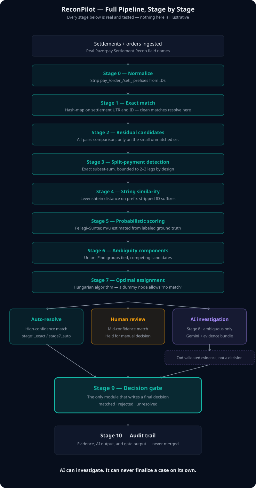

# ReconPilot

ReconPilot checks whether an incoming payment settlement actually matches the order it's supposed to pay for, and whether the amount is right. Most settlements match cleanly and get resolved instantly — no human or AI needed. Only the genuinely unclear cases go to an AI model for a second look, and even then the AI never has the final word: a separate piece of code always makes and records the real decision.

## Results

Verified against the live database, not cherry-picked examples:

- **176 of 194 settlements** matched automatically or via AI-confirmed investigation (90.7%)
- **18 settlements** correctly flagged for human review
- **0 settlements** matched to the wrong order
- **0 money mismatches** — every matched settlement (including multi-leg split payments) reconciles exactly to its order's expected amount

Run `npm run verify-decision-gate` in backend/ to reproduce these numbers yourself.

## Why this exists

Settlement mismatches happen at any scale — a slightly different transaction reference, a payment split across two transfers, a retry after a timeout. Someone always has to work out which records are genuine matches and which need a closer look before money gets marked as reconciled. Getting this wrong either means real money is misallocated, or a finance team wastes hours manually checking things a computer could resolve in milliseconds.

ReconPilot automates the part that's safe to automate, and stays careful about the part that isn't.

## How it works

When a settlement comes in, ReconPilot checks it against the order it should belong to:

- **Amount and reference match exactly?** It's matched instantly — no AI, no human, just code.
- **Payment was split into 2-3 parts that add up correctly?** Matched automatically too.
- **Two records look equally plausible, or the numbers don't clearly point to one answer?** An AI model reads the extra details (like transaction notes) and suggests which one is correct.
- **Still not confident, even after AI?** A human makes the final call.

No matter which path a case takes, only one part of the code is ever allowed to record the actual decision. The AI can suggest an answer — it can never write it down itself.

## Demo video

<!-- TODO: replace with the actual video link before submission -->
[▶ Watch the 5-minute demo](PASTE_VIDEO_LINK_HERE)

## Getting started

**Prerequisites:** Node.js 18+, MySQL 8 running locally, a Google Gemini API key (the free tier works).

### Backend

1. Clone the repo
2. `cd backend && npm install`
3. `cp .env.example .env` — then fill in your MySQL credentials and `GEMINI_API_KEY`
4. `npm run migrate`
5. `npm run seed` (optional — loads a synthetic test dataset)
6. `npm run dev` — runs at http://localhost:3000

### Frontend

1. `cd frontend && npm install`
2. `npm run dev` — runs at http://localhost:5173 and talks to the backend automatically

Open http://localhost:5173 once both are running.

## A note on API quota

ReconPilot's AI step uses Google Gemini's free tier, which allows about 5 requests per minute and roughly 20 per day. A full reconciliation run against a large dataset can use up most of that in one go, so for everyday testing, upload a small batch (5-10 records) instead of running against the full seeded dataset.

## Running tests

`cd backend && npm test` runs the unit test suite — matching logic, the decision gate, API routes, and the audit trail. Additional live-verification scripts exist in `backend/src/*/manualVerify.ts` for deeper checks against real data.

## Known limitations

- A reconciliation run reprocesses every currently-unresolved record in the database, not just the batch you just uploaded.
- The review queue isn't scoped to a single run — it always shows every pending item across the whole system.
- Split-payment detection only looks for 2-way and 3-way splits, not longer chains.
- The matching thresholds are calibrated against a labeled synthetic dataset built for this demo, not real production data.

---

This is a submission for the Razorpay AI Buildathon 2026, Track 4 (AI Finance Controller).
